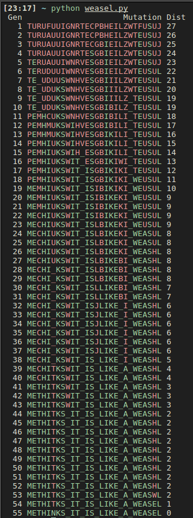

# Evolution Weasel Program

```
HAMLET:    Do you see yonder cloud that’s almost in shape of a camel?
POLONIUS:  By th' mass, and ’tis like a camel indeed.
HAMLET:    Methinks it is like a weasel.
POLONIUS:  It is backed like a weasel.
HAMLET:    Or like a whale.
POLONIUS:  Very like a whale.
```


> The weasel program, Dawkins' weasel, or the Dawkins weasel is a thought experiment and a variety of computer simulations illustrating it. Their aim is to demonstrate that the process that drives evolutionary systems—random variation combined with non-random cumulative selection—is different from pure chance. 
The thought experiment was formulated by Richard Dawkins, and the first simulation written by him; various other implementations of the program have been written by others.
                                                        
The ["Weasel" algorithm](https://en.wikipedia.org/wiki/Weasel_program) implemented here runs as follows:
1. **Start** - A random state (a string of 28 characters).
2. **Produce offspring** - Make N copies of the string.
3. **Mutate** - For each character in each of the copies, with a probability of P, replace the character with a new random character.
4. Compare each new string with the target string "METHINKS IT IS LIKE A WEASEL", and give each a score
    * The number of offspring **N** and the probability **P** are configurable (default values: **N=100** and **P=5%**)
    * The algorithm used for scoring is [Hamming distance](https://en.wikipedia.org/wiki/Hamming_distance)
    * *In real life there is no final pre-established target!*
5. ***Survival*** - Take the highest scoring string, and go to step **2**.



## Conclusions

* It's interesting to *vary the number of offsping per generation* and the *mutation probability* and see how generations evolve
    * For a higher N the generations evolve much more quickly towards the target
    * For a higher P evolution becomes random


